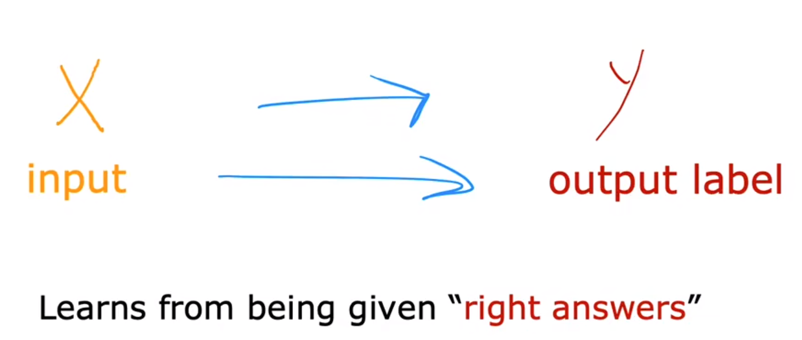
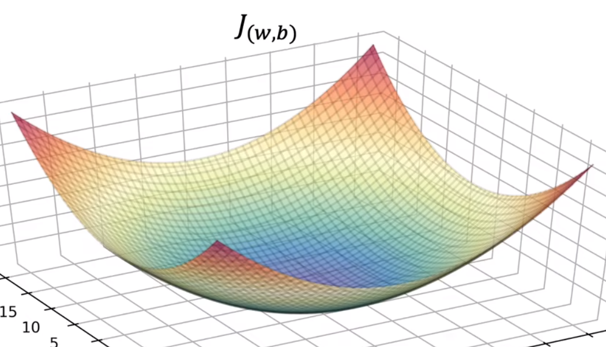
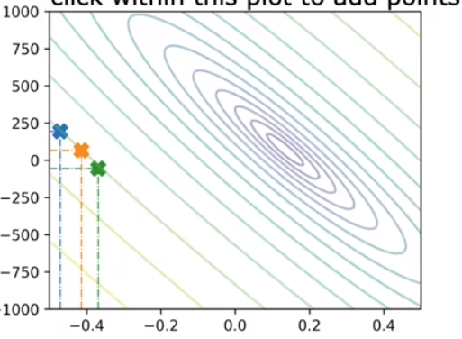
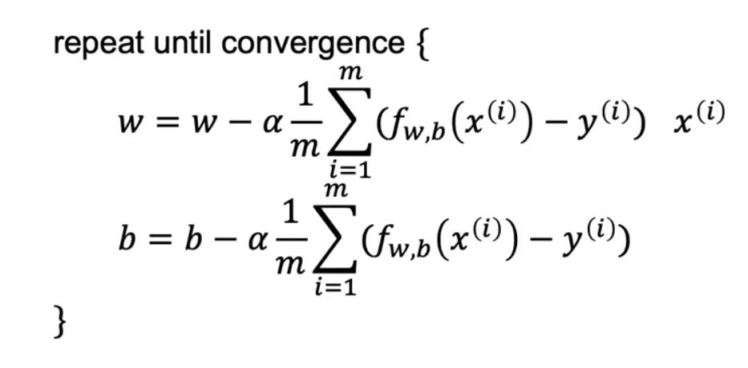

## ML Lecture1 Note1
- [ML Lecture1 Note1](#ml-lecture1-note1)
  - [ML的应用](#ml的应用)
  - [ML的分类](#ml的分类)
  - [监督学习](#监督学习)
  - [无监督学习](#无监督学习)
  - [相关术语（terminology）🧐](#相关术语terminology)
  - [线性回归模型](#线性回归模型)
  - [代价函数（cost function）](#代价函数cost-function)
  - [代价函数的可视化](#代价函数的可视化)
  - [梯度下降（gradient descent）](#梯度下降gradient-descent)
  - [关于梯度算法类别的补充](#关于梯度算法类别的补充)

### ML的应用
ML除了生活中的基本应用，实际上还用到了工业、医疗等其他领域。ML的最大作用是处理一些复杂的问题，即不能**显式**通过程序直接解决的问题，而是需要机器自己学习来解决的问题。未来的目标是实现AGI(artificial general intelligence)，即极像人类的ai。

### ML的分类
监督学习(supervised learning)，非监督学习(unsupervised learning)和强化学习(reinforcement learning)。其中监督学习的运用最广泛，作用也最大。    

### 监督学习

如图，即通过给出输入x和输出y（即正确答案），机器能通过监督学习找到其中的映射，在只给出x的情况下推测出y的值。e.g.输入一些用户信息以及广告信息来推测用户是否会点击它，这是推荐算法的一种。  
其中，监督学习主要有回归和分类两个种类。两者的区别是回归算法中是从无数可能结果中进行预测，而分类算法只是从有限的可能结果进行猜测。此外，回归算法面对的是数字问题，而分类算法面对的对象则十分广泛（是一个个category）。

### 无监督学习
"Find something interesting in unlabeled data".我们没有试图监督算法（即没有给出正确的样本结果y），而是让算法自己在获取的unlabeled数据中找到有趣的东西，如数据中可能包括的结构或模型。比如clustering（聚类）算法，找到数据中可以聚类的集合。e.g.新闻信息的聚类，DNA信息的聚类，市场中对用户进行分组聚类。此外，还有异常检测（anomaly detection）算法（用于检测交易是否正常等）和降维（dimensionality reduction）算法（用于压缩数据集）等、

### 相关术语（terminology）🧐
- **训练集**（training set）： 用来训练模型的数据
- **输入变量x**（input variable）
- **输出变量y**（ouput/target variable）
- (x，y): 表示单个样本   （x^(i)^,y^(i)^) 即第i个样本
- m：表示训练集的大小
- **$f$**： 即用监督算法得到的计算模型 用来预测结果
- **$\hat{y}$**： 即在给定输入下模型得到的预测结果
- **模型参数**（parameter）： 训练中可能不断改变的数值 用来构建模型 预测结果

### 线性回归模型
通常在监督学习中通过建立回归模型来解决回归问题，回归模型中有无数多种可能的数字输出（这也是它区别于分类模型的特点）。线性回归模型的目标函数即为简单的线性函数:  
$$f(x) = wx + b$$
可见其尽管很多时候不能得到有效的预测值，但是是一种简单实现的回归模型。

### 代价函数（cost function）
容易想到在“**暂时**”得到模型（参数是暂定的）后需要对模型进行评估，其中一种重要标准就是代价函数，单变量下的标准代价函数（方差代价函数）是：
$$J(w,b) = \frac{1}{2m} \sum_{i=1}^{m} ({\hat{y}}^i - y^i) ^2 ，即$$
$$J(w,b) = \frac{1}{2m} \sum_{i=1}^{m} (f(x^i) - y^i) ^2  $$
其中系数2是方便后续的偏导计算。这是最常见的代价函数，也十分有用。我们的目标即是${minimize}_{w,b}J(w,b)$来得到好的模型。不同的w和b参数确定了不同的线性回归模型，而不同的模型又在训练集给定时确定了损失函数的值。

<b>idea</b>

 其实训练集不变时，参数直接决定了损失函数值，这样看下来感觉就是求一个二元二次函数的极小值问题...

### 代价函数的可视化
好吧，上面的感觉是对的，对原损失函数进行分析可以得到一个二元二次函数，可以将其可视化为三维图形，如下图所示，极值点可以在中心找到：
    

此外，要想将三维图形二维化，使用等高线是一种很好的选择，如下图所示，距离中心越近的（w，b）对应的等高损失函数值越低：
  
在同一等高线上的点虽然构造的模型/参数存在差别，但是它们的损失函数值相同，从这点上看模型效果相同。

### 梯度下降（gradient descent）
经典算法，用于找到代价函数值最小时的参数。通过给定参数初值（通常取零向量）并不断调整它们使得代价函数值减小到一个极小值（**不一定是最小值**，只是local minima）。在**参数初值不同时得到最终的损失函数极小值可能不同**。而GD算法的经典式即为对每个参数变量用梯度进行更新：
$$ w_{i+1} = w_i - \alpha \frac{\partial j(w,b)}{\partial w}$$
其中参数可以扩展到多维，其中α是**学习率**（learning rate），取0~1之间的数，用于控制step的幅度大小，偏导值控制step的方向。特别的，学习率的选择十分重要，过小会使算法速度过慢，过大容易使得算法失效，要在两者中平衡，选择合适的lr。

- 注意：参数是**同时**（simultaneous）赋值更新的，即参数向量 $\vec{x}_i$ 更新到 $\vec{x}_{i+1}$  

回到上面的线性回归模型，使用GD算法可以得到迭代方程式如下：

特别的，平方损失函数在线性回归模型中是一个凸函数，极小值就是最小值，所以只要设定合适的lr就能找到满足（接近）损失函数的最小值的参数，找到很好的模型用于预测结果。

<b>idea1</b>

 模型的参数就是损失函数的变量，使用GD算法得到的就是局部凸函数的极小值，也就是损失函数的可能最小值。（这是GD的不足吗，可能找到的不是最好的模型）

<b>idea2</b>

 实际上学习率的选择应该是有范围的，用二阶泰勒展开可以找到学习率在 1/L里面时函数时必定收敛的，这也是该算法的最优步长。

### 关于梯度算法类别的补充
实际上，上面的公式表示的是**批量**（batch）梯度算法（BGD），即在每次下降时使用训练集中所有的数据进行训练，虽然准确度较高，但是耗时大，效率低。有另外一种方法是**随机梯度下降算法**（SGD），是随机选择一个数据进行训练，该方法很快，但是效果差，容易导致收敛不稳定甚至不收敛。所以一般选用的算法是上面两者的综合，即**小批量梯度算法**（mini-batch GD），即**选取子集数据**进行训练。

P : 梯度算法的练习见jupyter（其中有三种GD模型的训练过程）
  
 
补充资料 from：  

- https://zhuanlan.zhihu.com/p/445365836