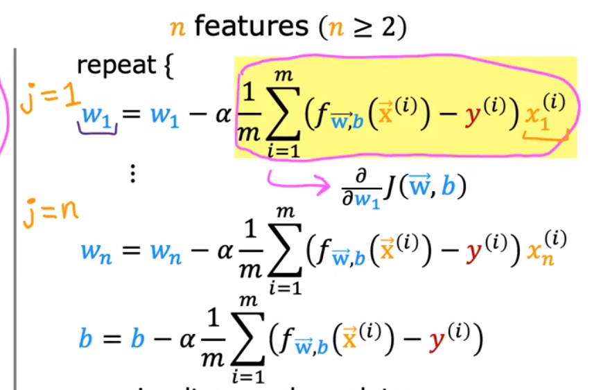
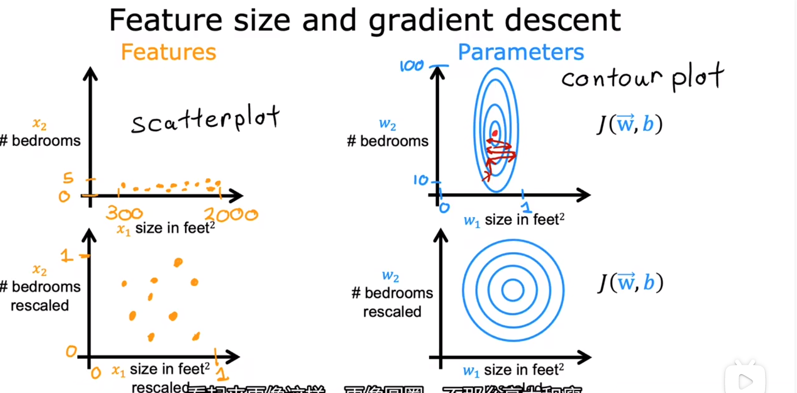
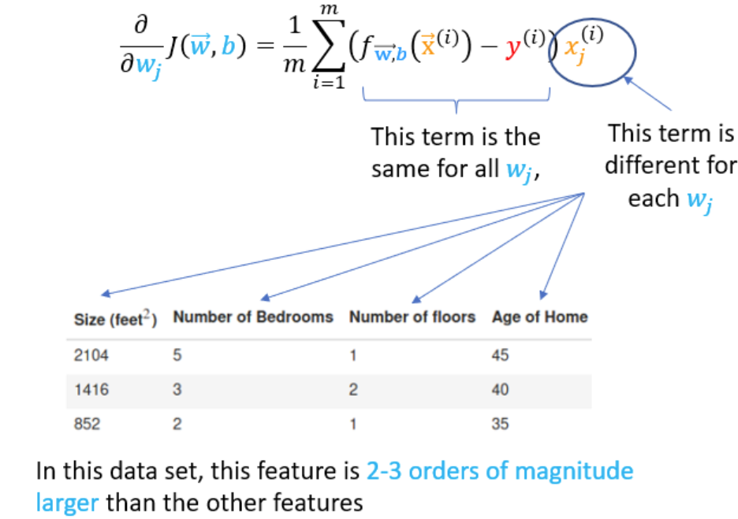
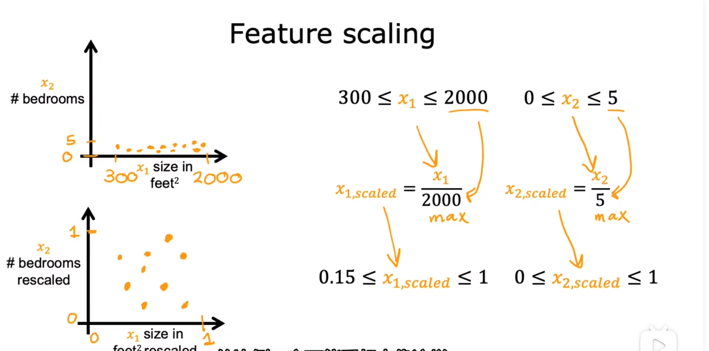
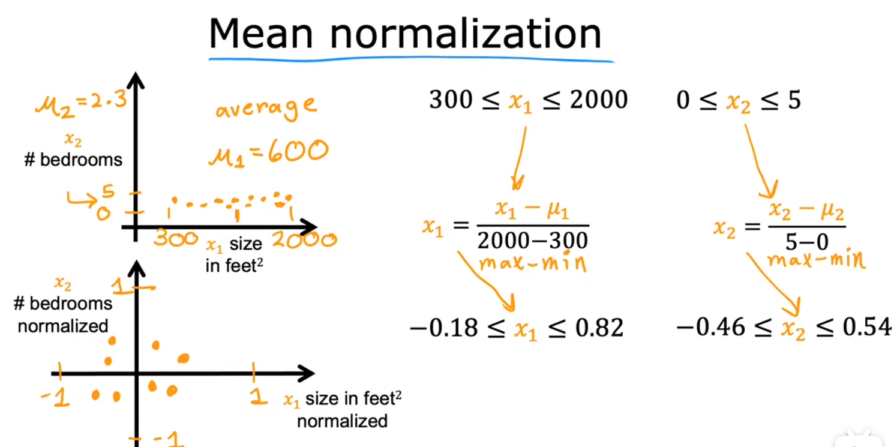
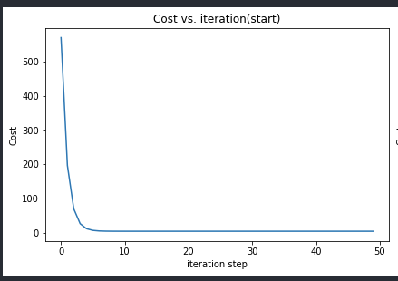
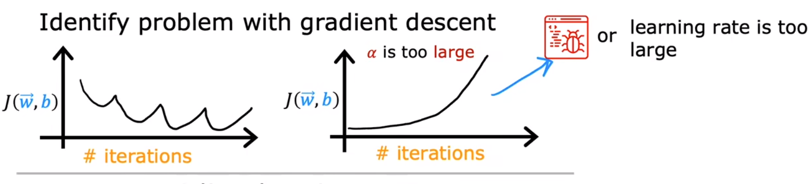

## ML Lecture1 Note2
- [ML Lecture1 Note2](#ml-lecture1-note2)
  - [多维特征](#多维特征)
  - [多元线性回归的GD](#多元线性回归的gd)
  - [特征缩放（Feature Scaling）](#特征缩放feature-scaling)
  - [梯度下降的收敛判断](#梯度下降的收敛判断)
  - [lr的设置](#lr的设置)
  - [特征工程 （Feature Engineering）](#特征工程-feature-engineering)
  - [多项式回归 （polynomial regression）](#多项式回归-polynomial-regression)
  - [scikit-learn library \&\& GD](#scikit-learn-library--gd)
  - [SUMMARY](#summary)
- [完结撒花 🎉🎉🎉](#完结撒花-)


### 多维特征
经典的推广到n元问题，即如果模型不再是单变量而是n变量时，它即从单元线性模型变为多元线性模型，这个时候模型的表达式拓展为一般形式（向量式）:
$$
  f(\mathbf{x})=\mathbf{w}^T\mathbf{x}+b ,  or
$$
$$
  f(\vec{x}) = \vec{w} \cdot \vec{x} +b
$$
在python的numpy中使用dot函数可以利用其向量化性质快速算出点积的结果。具体来说，相比于for循环逐个计算乘积并相加，使用dot函数时计算机硬件中其实实现了所有对应位置的**并行**计算（乘法），此外在计算加法时也不是一个一个相加，而是使用了**高效的加法方式**。所以，在大数据集训练中，能用向量化计算多用（有好轮子）！！

<details>
<summary><b>补充</b></summary>
<p> 这种底层硬件实际上是基于GPU和高级的CPU的单指令多数据管道（SIMD）模式。</p>
</details>

### 多元线性回归的GD
了解到向量化的概念后，可以用来方便地解决多个特征决定的线性方程回归问题，即多元线性回归模型，只需要在求微分的操作中转为向量化操作即可，公式如下：

<details>
<summary><b>补充</b></summary>
<p> 实际上还有一种叫正则方程法（normal equation）的方法解决线性回归问题，无需迭代，但是比较复杂，而且不适用于其他回归问题，一般不用。</p>
</details>

### 特征缩放（Feature Scaling）
由经验可知，在训练集中若某个特征相对于其他特征的一般取值偏大，则它对应的参数往往会偏小，反之亦然。这个时候这个参数的微小变化会导致结果的截然不同，而其他参数则不一定，所以构成了类似下图中椭圆的关系。

在椭圆状的模型中，执行梯度下降时收敛较慢，不稳定性高（这两个是猜的...）。好吧在后面的 lab 中给出了比较好的说明:

每次更新参数时由于对应参数的变量值相对较大，导致该梯度更新（下降）大，使得总的梯度下降不均匀。所以更好的模型应该是**近似圆形**的，即对应**原来的特征取值均匀**。这就对应了我们的标题——特征缩放，通过对特征值的缩放来构造一个更好的模型进行GD，会提高算法的效率。（下面的缩放都是基于目标值在±1左右）  
下面给出特征缩放的方式：  
1. 除以最大值法 如下图所示 保证范围均在0~1之间
2. 均值归一化（mean nomalization）用归一化思想时期范围在-1~1之间
3. Z-score Normalization 即正态标准化 
<details>
<summary><b>补充</b></summary>
<p> 在 feature scaling 后要注意的是进行BGD算法的时候 lr 要设置的特别大才能保证速度足够快！！ 此外在进行预测（使用测试集）的时候记得先把数据归一化后在使用模型预测~</p>
</details>

### 梯度下降的收敛判断
在进行GD算法的时候我们会得到代价函数$J$随着迭代次数变化的曲线，即**学习曲线**（learning curve），比如我使用BGD算法得到的一个曲线图如下：
  
Andrew给出了两种判断梯度下降收敛的方法：一是直接观察学习曲线图找到趋于平滑的范围即为收敛需要的iteration，另一种是用 $\epsilon$ 语言描述，即$J$下降值小于某个 $\epsilon$ 值时则跳出循环，终止学习。

### lr的设置
先来看看“学习失败”的学习曲线长什么样：

导致这两种学习曲线非平滑递减的原因是 lr 设置过大或者程序出现bug。而Andrew实际上给出的设置 lr 的方法就是我们经常自己做的试测法，即不断尝试不同的lr值，观测学习曲线来调整知道找到一个平衡效率和正确性的 lr 值。

### 特征工程 （Feature Engineering）
实际上即使用直觉并通过变换或合并原来的特征的方式去设计新的特征。在视频中的例子就是在长和宽的参数基础上加入面积特征参数。这样做完善了模型，同时有助于更好地预测结果。

### 多项式回归 （polynomial regression）
是对线性拟合的一种拓展，即拓展到了多项式函数（实际上应该可以拓展到各种函数），可以对参数用多项式来构造模型，即根式，n次幂等等。这相比于普通的线性模型更具有完备性。要注意的是无论使用什么函数进行拟合，在已知函数去构建模型的前提下，使用BGD算法的过程是一毛一样的，即只需要一开始将数据预处理：
$$ \vec{x} = g(\vec{x}) ， 即$$
$$ \vec{x}_i = g_i(\vec{x}_i)$$
最后都回归到一个多元线性回归问题上去了~~


### scikit-learn library && GD
- scaler函数用于进行特征缩放
``` python
scaler = StandardScaler()
X_norm = scaler.fit_transform(X_train)
```

- SGDRegressor函数用于构建回归模型（**当然还有LinearRegression等模型**）
```python
sgdr = SGDRegressor(max_iter=1000)
sgdr.fit(X_norm, y_train)
```

- 查看参数 w(coefficients 系数) 和 b(intercept 截距)
```python
b_norm = sgdr.intercept_
w_norm = sgdr.coef_
```

- 进行预测
```python
# make a prediction using sgdr.predict()
y_pred_sgd = sgdr.predict(X_norm)
# make a prediction using w,b. 
y_pred = np.dot(X_norm, w_norm) + b_norm  
```
### SUMMARY
最后对一般线性回归问题进行方法总结：  
1. 首先构建 or 获取数据集 （在 skill 中给出构造数据集的方法）
2. 分割数据集 —— 取做训练集和测试集（可使用 feature scaling 方式进行预处理）
3. 设置训练参数 —— lr epoch次数 batch_size
4. 构建模型 并选择 GD 算法进行反向传播（线性回归模型的核心）  
5. 在epoch中打印日志，如回报 loss 值等（可选）
6. 得到参数 使用测试集进行测试
7. 对模型进行评估 使用 MSE R方法等进行损失值的评测
8. 对模型进行可视化 

## 完结撒花 🎉🎉🎉