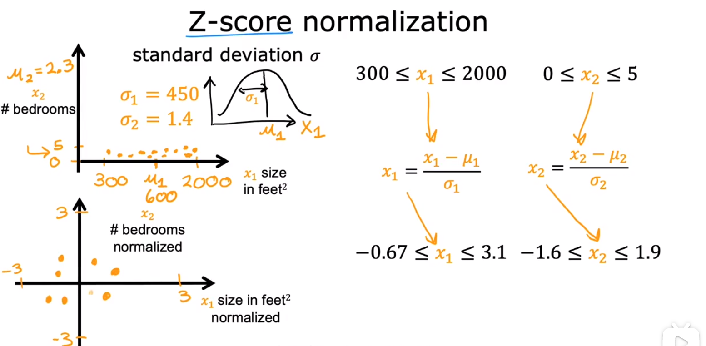

## ML Lecture1 Note2
- [ML Lecture1 Note2](#ml-lecture1-note2)
  - [多维特征](#多维特征)
  - [多元线性回归的GD](#多元线性回归的gd)
  - [特征缩放（Feature Scaling）](#特征缩放feature-scaling)
  - [梯度下降的收敛判断](#梯度下降的收敛判断)
  - [lr的设置](#lr的设置)

### 多维特征
经典的推广到n元问题，即如果模型不再是单变量而是n变量时，它即从单元线性模型变为多元线性模型，这个时候模型的表达式拓展为一般形式（向量式）:
$$
  f(\mathbf{x})=\mathbf{w}^T\mathbf{x}+b ,  or
$$
$$
  f(\vec{x}) = \vec{w} \cdot \vec{x} +b
$$
在python的numpy中使用dot函数可以利用其向量化性质快速算出点积的结果。具体来说，相比于for循环逐个计算乘积并相加，使用dot函数时计算机硬件中其实实现了所有对应位置的**并行**计算（乘法），此外在计算加法时也不是一个一个相加，而是使用了**高效的加法方式**。所以，在大数据集训练中，能用向量化计算多用（有好轮子）！！

<b>补充</b>

 这种底层硬件实际上是基于GPU和高级的CPU的单指令多数据管道（SIMD）模式。

### 多元线性回归的GD
了解到向量化的概念后，可以用来方便地解决多个特征决定的线性方程回归问题，即多元线性回归模型，只需要在求微分的操作中转为向量化操作即可，公式如下：

<b>补充</b>

 实际上还有一种叫正则方程法（normal equation）的方法解决线性回归问题，无需迭代，但是比较复杂，而且不适用于其他回归问题，一般不用。

### 特征缩放（Feature Scaling）
由经验可知，在训练集中若某个特征相对于其他特征的一般取值偏大，则它对应的参数往往会偏小，反之亦然。这个时候这个参数的微小变化会导致结果的截然不同，而其他参数则不一定，所以构成了类似下图中椭圆的关系。

在椭圆状的模型中，执行梯度下降时收敛较慢，不稳定性高（这两个是猜的...），更好的模型应该是近似圆形的，即对应原来的特征取值均匀。这就对应了我们的标题——特征缩放，通过对特征值的缩放来构造一个更好的模型进行GD，会提高算法的效率。（下面的缩放都是基于目标值在±1左右）  
下面给出特征缩放的方式：  
1. 除以最大值法 如下图所示 保证范围均在0~1之间
2. 均值归一化（mean nomalization）用归一化思想时期范围在-1~1之间
3. Z-score Normalization 即正态标准化 

### 梯度下降的收敛判断

### lr的设置

