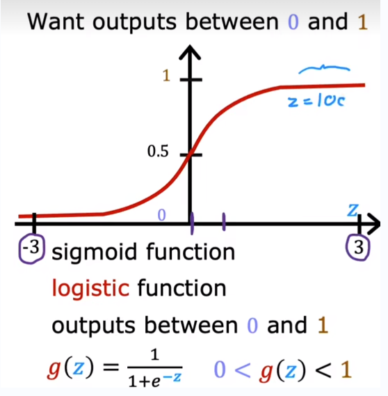

## ML Lecture1 Note3
- [ML Lecture1 Note3](#ml-lecture1-note3)
  - [动机与目的](#动机与目的)
  - [逻辑回归（logistic regression）](#逻辑回归logistic-regression)
  - [决策边界（decision boundary）](#决策边界decision-boundary)
  - [逻辑回归中的代价函数](#逻辑回归中的代价函数)

### 动机与目的
回顾分类问题解决的是从有限中进行预测。其中二分类问题（binary classification）指的是可能答案只有两类（class），通常是是（positive class）和否（负类）。对于这种类型的问题，如果使用线性回归的话，样本的分布容易对分类的标准造成很大的影响，分类效果一般不理想。

### 逻辑回归（logistic regression）
建立逻辑回归的时候用到了 sigmoid 函数， 也叫逻辑函数，函数曲线如下所示：
  
在实际的逻辑回归模型中z的值可以由线性回归模型得到，表达式如下：

该模型的输出可以表示为模型认为在给定输入 x 下标签 y 为 1 的**概率**。

### 决策边界（decision boundary）
我们可以通过设置阈值来对 y 进行预测，即使用上面的 sigmoid 函数，大于阈值则取 1 ，否则取 0。特别的，考虑线性回归模型下的 sigmoid 函数，当 $z=0$ 时，即 $\vec{w}\cdot\vec{x} + b = 0$ 时，该直线即为决策边界，此时 y=0 和 y=1 的概率几乎相等。下图为好模型的决策边界（线性）：
  
特别的，决策边界不一定都是线性的，比如将多项式转为逻辑回归中 z 的表达式：

### 逻辑回归中的代价函数
