## ML Lecture1 Note3
- [ML Lecture1 Note3](#ml-lecture1-note3)
  - [动机与目的](#动机与目的)
  - [逻辑回归（logistic regression）](#逻辑回归logistic-regression)
  - [决策边界（decision boundary）](#决策边界decision-boundary)
  - [逻辑回归中的代价函数](#逻辑回归中的代价函数)
  - [逻辑回归的梯度下降实现](#逻辑回归的梯度下降实现)
  - [过拟合问题 —— Overfitting](#过拟合问题--overfitting)
  - [过拟合处理](#过拟合处理)
  - [正则化（regularization）](#正则化regularization)
    - [用于线性回归的正则化](#用于线性回归的正则化)
    - [用于逻辑回归的正则化](#用于逻辑回归的正则化)
- [完结撒花 ✨✨✨](#完结撒花-)

### 动机与目的
回顾分类问题解决的是从有限中进行预测。其中二分类问题（binary classification）指的是可能答案只有两类（class），通常是是（positive class）和否（负类）。对于这种类型的问题，如果使用线性回归的话，样本的分布容易对分类的标准造成很大的影响，分类效果一般不理想。

### 逻辑回归（logistic regression）
建立逻辑回归的时候用到了 **sigmoid** 函数， 也叫逻辑函数，函数曲线如下所示：
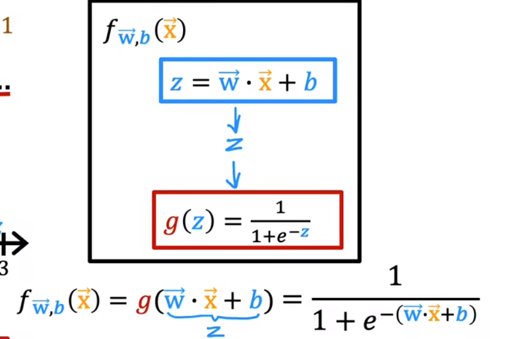  
在实际的逻辑回归模型中z的值可以由线性回归模型得到，表达式如下：
  
该模型的输出可以表示为模型认为在给定输入 x 下标签 y 为 1 的**概率**。

<b>补充</b>

 使用 sigmoid 函数的理由是在分类问题中主要讨论的是对各个类别的可能性的预测，应该将结果设置在0~1之间，同时 sigmoid 函数具有很好凹凸性以及可导性，是正向传播中最后一层很好的选择（主要是二分类问题）~

### 决策边界（decision boundary）
我们可以通过设置阈值来对 y 进行预测，即使用上面的 sigmoid 函数，大于阈值则取 1 ，否则取 0。特别的，考虑线性回归模型下的 sigmoid 函数，当 $z=0$ 时，即 $\vec{w}\cdot\vec{x} + b = 0$ 时，该直线即为决策边界。考虑其几何意义，此时 y=0 和 y=1 的概率几乎相等，而在直线两边则概率不等，预测结果 1 和 0 较为集中地分布直线两边。下图为好模型的决策边界（线性）：  
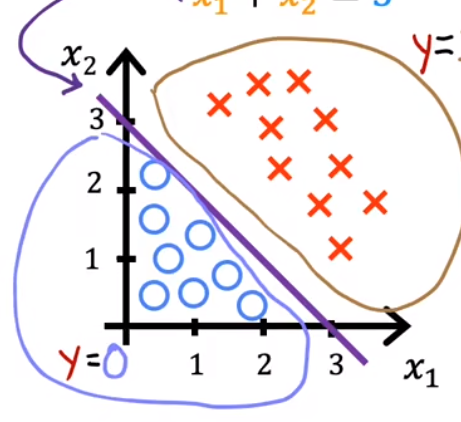  
特别的，决策边界不一定都是线性的，比如将多项式转为逻辑回归中 z 的表达式：
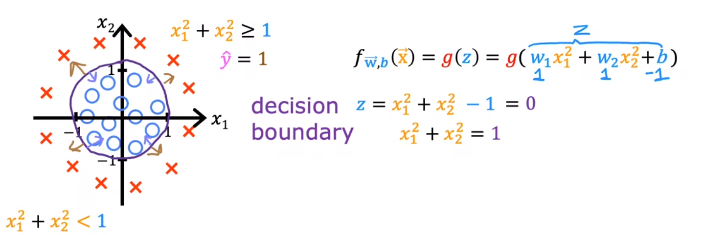

### 逻辑回归中的代价函数
在逻辑回归中同样要用代价函数对模型进行评估，而如果使用之前线性回归中的平方误差代价函数，由于此时的 sigmoid 函数不再是线性的了，会生成一个非凸函数，使得在BGD的时候有多个极值点，不能有效地找到 optimal value 。如图：  
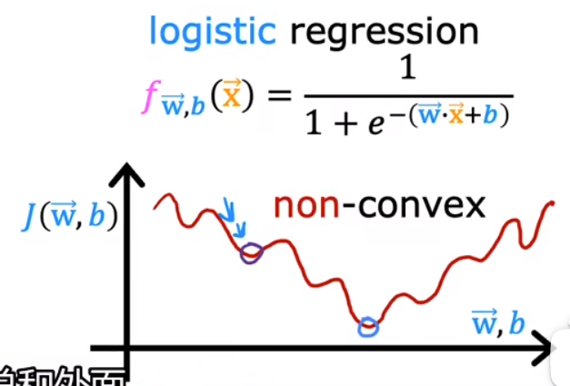   
可见这不是一个优秀的模型评估函数，在得到的是一个非凸函数的同时它没有很好利用模型的二分类性质（非 0 即 1），我们需要重新找到一个具有上述性质的好的 loss function，一种想法是用对数函数来对 sigmoid 这类指数函数进行形状优化，所以得到的一种 loss function 如下（它也叫交叉熵函数）：  
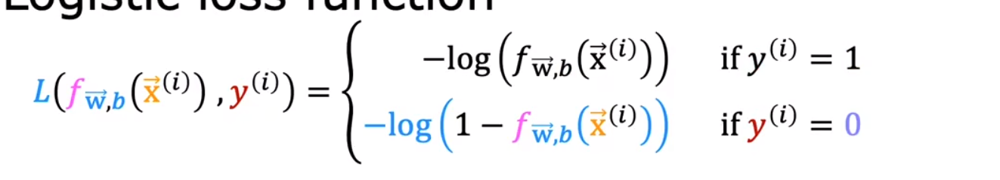
（此时可以用二阶导证明复合函数的凸性）。在该函数中，考虑单个样本的损失函数时，若真实值为 1 ， 则如果函数值越接近 0 ，损失值越小，否则越大，对真实值为 0 时同理，能很好的评估模型的二分类效果。特别的，该函数可以简化为下面的形式：
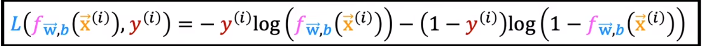
对所有单个样本的损失值求平均，即得到该模型在训练集下的损失函数如下：
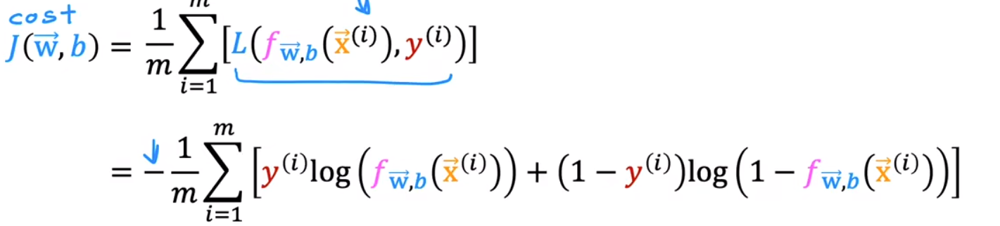

<b>补充</b>

 实际上得到该函数的底层原理是极大似然估计，它对模型的预测给出了一个很好的评估~

### 逻辑回归的梯度下降实现
通过使用梯度下降算法对上面式子分别对 $w,b$ 求偏导后得到每轮的更新值如下所示：
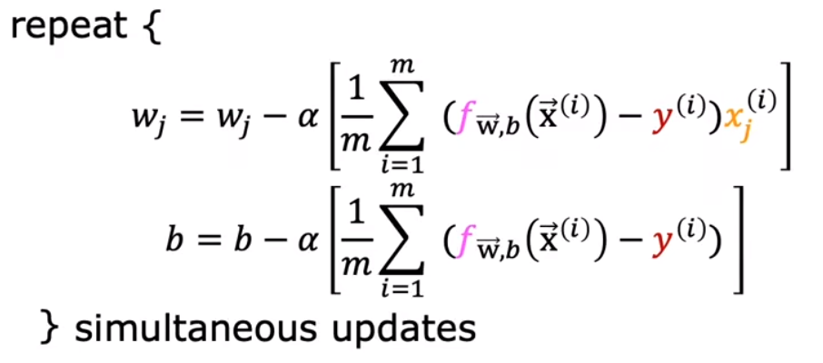   
注意：不要将该梯度更新公式与线性回归混淆，它们的 $f(x)$ 是不同的，但有意思的是形式上是一样的。

### 过拟合问题 —— Overfitting
下面对模型的拟合情况进行讨论。首先考虑欠拟合（underfitting）问题，当一个模型不能很好地拟合训练集数据的时候，我们称它是**欠拟合**的，也称算法的高偏差（high bias）—— 这里的高偏差有两种理解，一是模型与实际情况的偏差高，二是我们先入为主设计模型（比如给一个不是线性的模型设定为线性模型）导致了高的偏差。如图：  
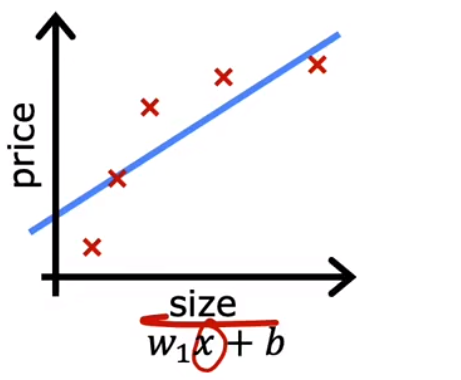   
再考虑优秀的模型，它在训练集中的 cost 较低，可以很好地预测数据——即具有“**泛化**”（generalization）能力，如图：  
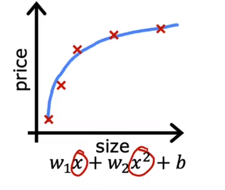   
最后再考虑**过拟合**问题，我们在训练时可能会得到一种模型，它在训练集中的 cost 非常低，即非常符合训练集的每个点，但是不具有很好的泛化能力，即在拟合训练集数据的时候牺牲了准确预测测试集数据的能力，太过于拟合导致了模型的不完备性，如图：  
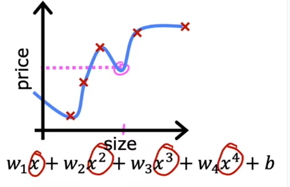   
这种模型具有高的方差（high variance），指的是在使用这种方式对训练集有稍微不同的模型进行训练时，得到的结果往往会有很大的不同。
同样的，在分类问题里面也有这三种拟合结果:
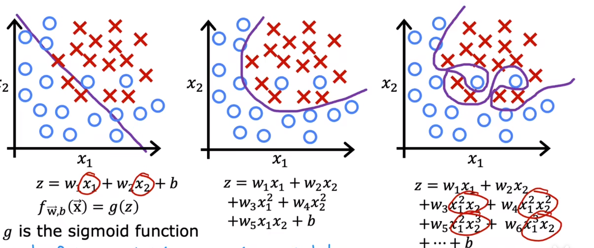

### 过拟合处理
首要的解决方法是可以增加样本的数量。此外，在**特征数量过多且数据较少**时也容易发生过拟合的情况，这个时候一般选择减少特征数量，只选取你认为关键的特征，这也称作特征选择（feature selecting）。但是特征选择会容易因为主观因素导致丢失了模型中有用的特征。所以我们常用的是**正则化**方法，在调整模型参数的时候限制某些特征的参数，减少它们的作用但不是像特征选择那样完全消除它们。

<b>补充1</b>

 在课程中提到一个多项式比如 ax + bx^2 的时候说这是两个特征，我感觉这是用了<b>多项式特征拓展的</b>的技巧将其特征拓展了吧。btw，这个方法经常和正则化搭配使用~

<b>补充2</b>

 接着上面的多项式问题，在普通的多项式回归问题中，通常来说多项式的阶数越高，模型的表达能力越强，它也会越容易过拟合。

### 正则化（regularization）
正如上面一个 section 所提到的，我们通常需要通过正则化的方法去惩罚（正则化）某些参数 $w$，有效的方法是在损失函数中加入该参数，让我们的模型取最小化它们。但是仍存在问题——即我们不知道哪些参数需要进行正则化处理，于是有了下面的（较为朴素的）正则化方法：
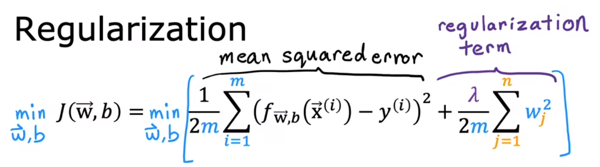  
第一项描述的是拟合数据的好坏，第二项描述的是对参数的正则化程度，其中正则化参数 $λ$ 作用则是对这两个目标进行权衡调整。
    
#### 用于线性回归的正则化
使用 GD 算法可以得到代入正则项后的参数更新公式（反向传播）如下：
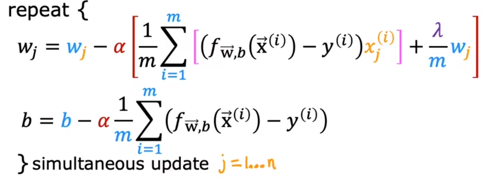
特别的，将含有 $w_j$ 的项进行合并可以得到 $(1-α\frac{λ}{m}) w_j$，可以发现每次迭代都都 $w_j$ 进行了微弱的减少。
#### 用于逻辑回归的正则化
公式和线性回归的一样，只是函数换成了外层为 sigmoid 函数，不再赘述。

## 完结撒花 ✨✨✨

